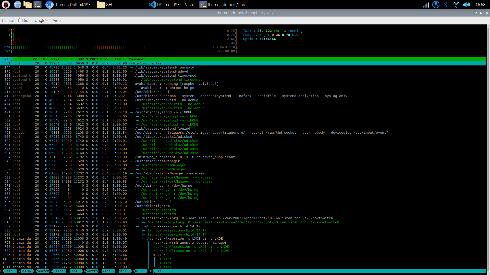

# <span style='color: #0f2;'>**ig2i@isel**</span>:<span style='color: #4DA6FF; font-family: Monospace'>~ $ ISEL/TP2</span>

[> **Accès au Repository d'ISEL** <](https://github.com/Thomas-Duthoit/ISEL)

***

## `./Sommaire`
[> *Indentification de l'utilisateur*](#iduser)

[> *Permissions sur les fichiers*](#perms)

[> *Gestion des Utilisateurs/Groupes*](#gestugrp)

[> *Processus et Ordonnancement*](#processus)

[> *E/S d'un processus*](#es)

[> *Redirection de données*](#redir)

***

<div id="iduser">

### **Identification utilisateur:**
```
id
> renvoie l'uid, le gid, et les groupes auxquels on appartient  ->  renvoie l'identité courrante
```

- UID: **`User Identifier`** = Numéro qui identifie un utilisateur.
<br>
- Les utilisateurs sont organisés en groupes => Chaque groupe possède un GID **`(Group Identifier)`**

***

>`/etc/passwd` contient les mots de passe de tout les utilisateurs:

=> Structure classique en colonnes: 
- nom_du_compte
- mot_de_passe*
- numero_utilisateur
- numero_de_groupe
- commentaires*
- répertoire_personnel
- commande*

> `/etc/group`: contient la liste des utilisateurs appartenant aux différents groupes

Un nom d'utilisateur peut apparaitre dans plusieurs groupes
<br>
On peut changer de groupe avec la commande <span style='color: #0f0;'>newgrp</span>

***

<div id="perms">

### **Permissions sur les fichiers: 3 permissions * 3 classes**

**Fichiers:**
<br>
3 permissions: rwx:
- r: droit de lecture du fichier
- w: droit d'écriture du fichier
- x: droit d'éxécution du fichier

**Répertoires:**
<br>
les clés rwx perdent leur signification habituelle:
- r: droit de lecture: listage (ls)
- w: droit décriture (rm, rmdir, mkdir, touch)
- x: droit de traversée (cd)

***

### **Algorithme des droits d'accès:**

Un processus lancé par un utilisateur **(UID, GID)** est caractérisé par des identifiants effectifs: **EUID** et **EGID**.
<br>
Le plus souvent, **EUID**=**UID** et **EGID**=**GID**

***

### **Chaque fichier est caractérisé par:**
- le propriéataire du fichier: **FUID**
- Le groupe de fichier: **FGID**
- Ses permissions d'accès pour les classes **user**, **group**, **other**
> Utiliser <span style='color: #0f0;'>ls -l</span> pour voir les infos

***

### **Modification des permissions: <span style='color: #0f0;'>chmod</span>**

- Mode absolu: <span style='color: #0f0;'>chmod \<permissions en octal> <fichiers à modifier></span>

- Mode symbolique: <span style='color: #0f0;'>chmod \<liste des permissions>* <fichiers à modifier></span>

\*séparés par une virgule et sans espace blancs

#### <ins>Mode absolu</ins>:

permissions d'accès:
- r=4
- w=2
- x=1
- 0=aucuns droits

#### <ins>Mode symbolique</ins>:
chaque permissions s'exprime par **[ugoa][+-=][rwxst]**
- u = user
- o = other
- a = all
- g = groupe

<span style='color: #0f0;'>umask \<mask></span> : masque de création des fichiers (inverse de nos permissions)
<br>
La valeur de umask est exprimée en base octale:

> "umask 066: sécurité et souplesse"

***
<div id="gestugrp">

### **Gestion des Utilisateurs/Groupes**

***

<span style='color: #0f0;'>newgrp</span>: permet à l'utilisateur de changer de groupe principal
<br>
<span style='color: #0f0;'>chown</span>: permet de changer le propriétaire du fichier
<br>
<span style='color: #0f0;'>chgrp</span>: permet de changer le groupe du fichier

***

> **Utilité du groupe principal par rapport aux groupes secondaires:** Quand on crée un fichier, il appartiendra par défaut à notre groupe principal

***
<span style='color: #0f0;'>adduser user</span> : ajouter user
<br>
<span style='color: #0f0;'>addgroup group</span> : ajouter le groupe group
<br>
<span style='color: #0f0;'>passwd user</span> : change le mdp de user 
<br>
<span style='color: #0f0;'>deluser user</span> : supprime l'utilisateur user
<br>
<span style='color: #0f0;'>delgroup group</span> : supprime le groupe groupe

***

<div id="processus">

### **Processus et Ordonnancement**

Un programme en cours d'éxécution est un processus
<br>
Plusieurs processus peuvent être exécutés en donnant l'impression que chacun dispose du processeur pour lui tout seul.
<br>
C'est grâce au mécanisme d'ordonnancement en **temps partagé**

***

gâteau d'anniversaire = recette + ingrédients + faire la cuisine
<br>
- recette = programme
- ingrédients = paramètres
- faire la cuisine = processus

***

- les processus sont organisés en **arborescence de processus**
    - Un **processus père** crée un ou plusieurs **processus fils**
    - Chaque processus est identifié par son **PID** (process id)
- Les processus sont **ordonnancés** par le noyau:
    - Chaque processus peut s'éxécuter pendant un **quantum temps**, puis doit laisser sa place sur le processeur
    - Son contexte est sauvegardé en mémoire vive, un nouveau contexte est chargé sur le processeur
- Les changements de contexte sappellent des **commutations**
    - Si trop de contextes en mémoire vive: on **pagine** sur le disque dans une partition dédiée: **swap**

***

#### **Différents états d'un processus:**

- <ins>**Elu/Actif:**</ins>
    - Le processus a le contrôle du processeur
- <ins>**Pret/Endormi:**</ins>
    - Toutes les ressources sont dispo sauf le CPU (en file d'attente)
- <ins>**Bloqué/Stoppé:**</ins>
    - En attente d'une ressource autre que CPU ou d'un événement
- <ins>**Zombi:**</ins>
    - Execution terminée, prêt à mourir
    - Le processus père n'a pas encore pris en compte sa mort

***

```
================AFFICHER LES PROCESSUS================
Différentes commandes possibles, par exemple:        
        ps
        pstree
        top
        htop
        pidof w

======================================================
```

<ins>Exemple:</ins> la commande **`htop`**



***

`PR`: Priorité d'un processus, elle dépend également de l'utilisateur qui le lance.

***

Un processus peut être:
- Synchrone
    - Au premier plan de l'interpréteur
    - On ne peut pas lancer d'autre commande
- Asynchrone
    - En arrière-plan
    - On peut continuer à se servir du shell

***

#### **ps: Affiche les processus en cours d'éxécution**

- **<span style='color: #0f0;'>ps -a</span>**: tous les processus associés à un terminal
- **<span style='color: #0f0;'>ps -ax</span>**: tous les processus
- **<span style='color: #0f0;'>ps -l</span>**: long listing
- **<span style='color: #0f0;'>ps -U \<username></span>**: afficher tout les processus d'un utilisateur (uid)
- **<span style='color: #0f0;'>ps -o \<format></span>**: demander un format particulier

**<span style='color: #0f0;'>tty</span>**: numéro du terminal actuel

***

### **Commande <span style='color: #0f0;'>kill</span>**

Envoie un signal à un ou des processus:
- **<span style='color: #0f0;'>kill -\<n> \<PID></span>**: envoie un signal **n** au processus **PID**
- **<span style='color: #0f0;'>kill -\<n> -1</span>**: envoie le signal **\<n>** à tous les processus dont l'UID réel est **identique** à **l'UID effectif du propriétaire** du shell émetteur
    - **autrement dit le signal est envoyé à tous les processus de l'utilisateur**
- **<span style='color: #0f0;'>kill -\<n> -\<PID></span>**: envoie le signal **\<n>** à tous les processus du **groupe PID**

****

#### **nice et renice:**

Change la priorité des processus

***

<div id="es">

### **E/S d'un processus**

**0** -> entrée stantard: **stdin**
<br>
**1** -> sortie standard: **stdout**
<br>
**2** -> la sortie d'erreur: **stderr**

<ins>Par défaut:</ins>
- stdin = clavier
- stdout et stderr = écran

***

<div id="redir">

### **Redirection de données**

> **la commande est suivie du symbole < et du nom de fichier**
<br>
*exemple:*
<br> 
wx < fichier

***

**Redirection des résultats**

La commande est suivie du symbole **>** et du nom de fichier
- **commande > result** => Création/Ecrasement
- **commande >> result** => Ajout (Concaténation)

Redirection d'erreur: **2> fichier**
- Exemple: commande 2> error

***

**Combinaisons:**
- Exemple: commande > result < data 2> error
- **1>&2** redirige la sortie standard vers la sortie d'erreur
- **2>&1** inversement
- A placer la la fin des commandes

***

**echo -n** : pas de retour à la ligne après le echo

***